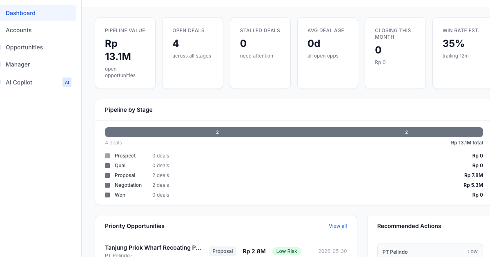

# AI Sales Advisor — EON Chemical

An AI-powered sales pipeline dashboard built for PT Eonchemicals Putra's sales team. Manage accounts, track opportunities, surface priority deals, and get intelligent product recommendations — all in one fast, offline-capable interface.



**Live:** [srkk-eonchemicals.edmund.link](https://srkk-eonchemicals.edmund.link)

---

## Features

- **Sales Dashboard** — Pipeline value, open deals, stalled deal alerts, win rate, and closing-this-month at a glance
- **Pipeline by Stage** — Visual breakdown across Prospect → Qual → Proposal → Negotiation → Won
- **Priority Opportunities** — Sorted by risk, value, and close date so reps focus on what matters
- **AI Recommendations** — Product suggestions scored by Industry Fit (35%), Similar Accounts (25%), Account Affinity (20%), and Use-Case Fit (20%)
- **Account Management** — 25 accounts across Marine/Ports, Mining, and General Industrial sectors
- **Opportunity Tracker** — 60 opportunities with full detail views, stage history, and next-action prompts
- **Manager Dashboard** — Team performance overview and pipeline health metrics
- **AI Copilot** — Chat interface for natural-language queries against your sales data

---

## Tech Stack

| Layer | Technology |
|---|---|
| Framework | SvelteKit 5 |
| Styling | Tailwind CSS 3 |
| Database | SQLite + Drizzle ORM |
| Language | TypeScript |
| Icons | Lucide Svelte |
| Deployment | Cloudflare Pages (static) |
| Build | Vite 6 |

---

## Getting Started

**Prerequisites:** Node.js 18+

```bash
# Install dependencies, set up database, and seed demo data
npm run setup
```

```bash
# Start dev server
npm run dev
```

Open [http://localhost:5173](http://localhost:5173).

### Database Commands

```bash
npm run db:migrate    # Run migrations
npm run db:seed       # Seed demo data (25 accounts, 60 opportunities, 50 products)
npm run db:studio     # Open Drizzle Studio (visual DB browser)
```

---

## Seeded Demo Data

| Entity | Count | Details |
|---|---|---|
| Accounts | 25 | Marine/Ports, Mining, General Industrial |
| Opportunities | 60 | Across all pipeline stages |
| Products | 50 | Chemical products with use-case tags |
| Users | 5 | Sales reps + 1 manager |

---

## Project Structure

```
src/
├── routes/
│   ├── +page.svelte              # Sales Dashboard
│   ├── accounts/                 # Account list + detail
│   ├── opportunities/            # Opportunity list + detail
│   ├── manager/                  # Manager analytics
│   ├── copilot/                  # AI chat interface
│   └── api/                      # API endpoints
├── lib/
│   ├── components/ui/            # Reusable UI components
│   ├── stores/data.ts            # Svelte stores
│   └── types/index.ts            # TypeScript types
scripts/
├── migrate.ts                    # Database migration runner
└── seed.ts                       # Demo data seeder
```

---

## Deployment

This app deploys as a fully static site to Cloudflare Pages — no server, no Workers, zero ongoing cost.

```bash
npm run build
npx wrangler deploy
```

See [CLOUDFLARE_DEPLOYMENT.md](./CLOUDFLARE_DEPLOYMENT.md) for full deployment guide.

---

## Roadmap

- [ ] Connect AI Copilot to Claude API for live responses
- [ ] Real-time sync via Cloudflare D1
- [ ] Email digest for stalled deals
- [ ] Mobile PWA support

---

Built by [Edmund Situmorang](https://edmund.link) for PT Eonchemicals Putra.
